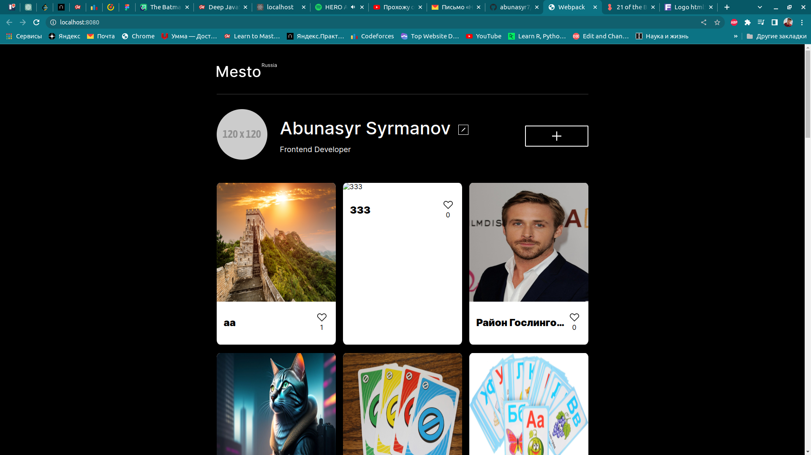

# Проект 4: Место

В данном проекте было необходимо создать полноценное веб-приложение с использование только HML5, CSS3 и JavaScript. 

Целью данного проекта является редактирование профиля, добавление и удаление карточек, а также действия с кнопкой ("Лайк").

Ссылка на проект https://abunasyr7.github.io/mesto/


## Использование

Для начала необходимо выбрать корректную версию `node` с помощью команды

```shell
nvm use
```

Далее для запуска проекта необходимо установить все необходимые пакеты и запустить проекты, комнады показаны в нужном порядке

```shell
npm run install
npm run dev
```

## Функциональность

В данном проекте была полноценна использована JavaScript, за счёт чего сайт стал более динамичным.

Использовались интсрументы, которые были раннее изучены в тренажере, такие как: функиця, объекты, массивы, методы forEach(), загрузка элементов на страницу через DOM, а также действия над объектами(изменение их со статического на динамический с помощью DOM).

## Технологии
- HTML5
- CSS3
- JavaScript
- Webpack
- Babel



